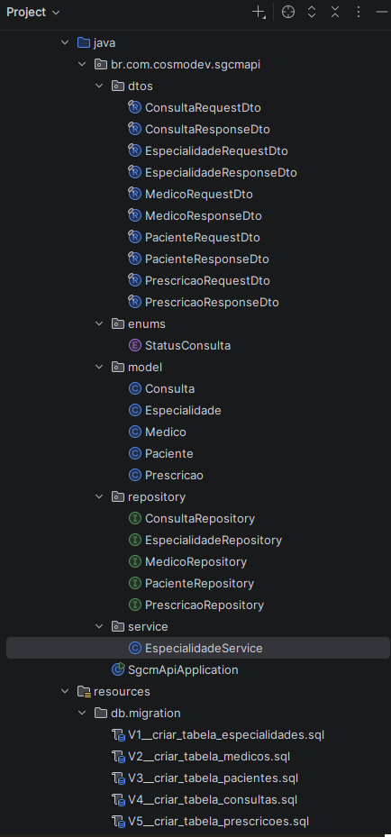
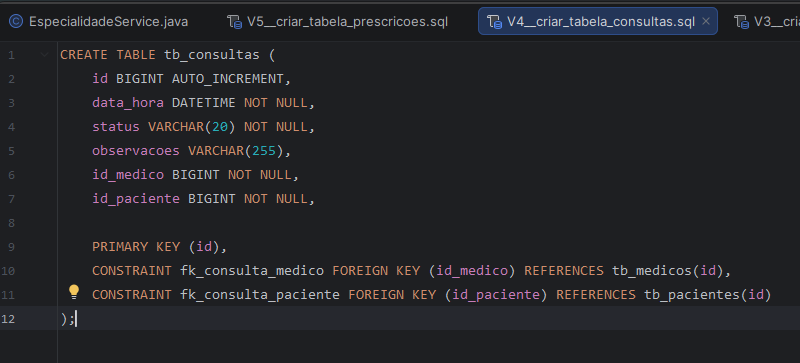
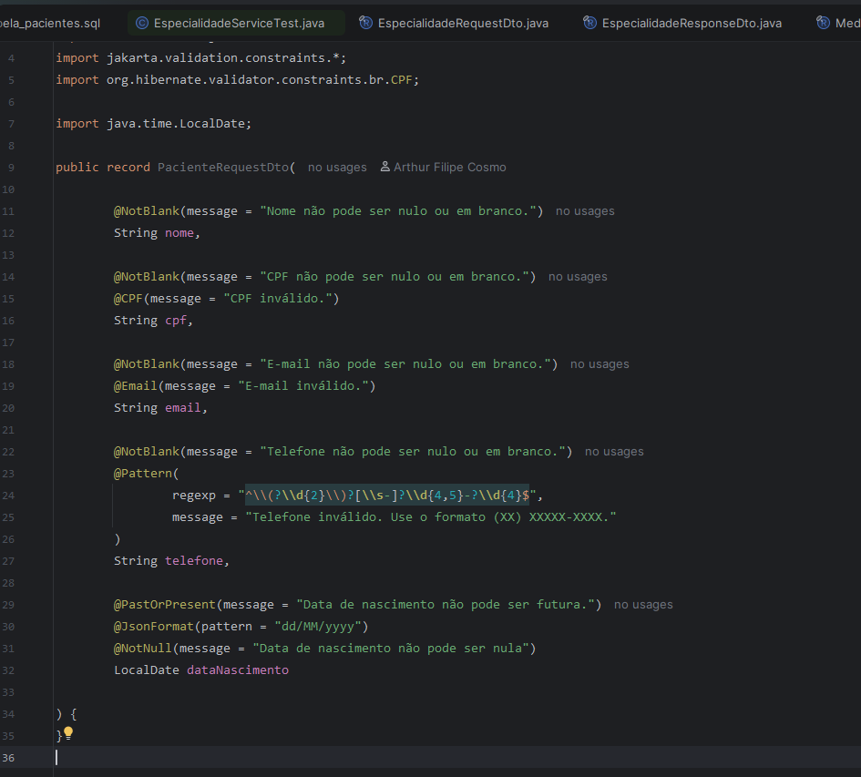
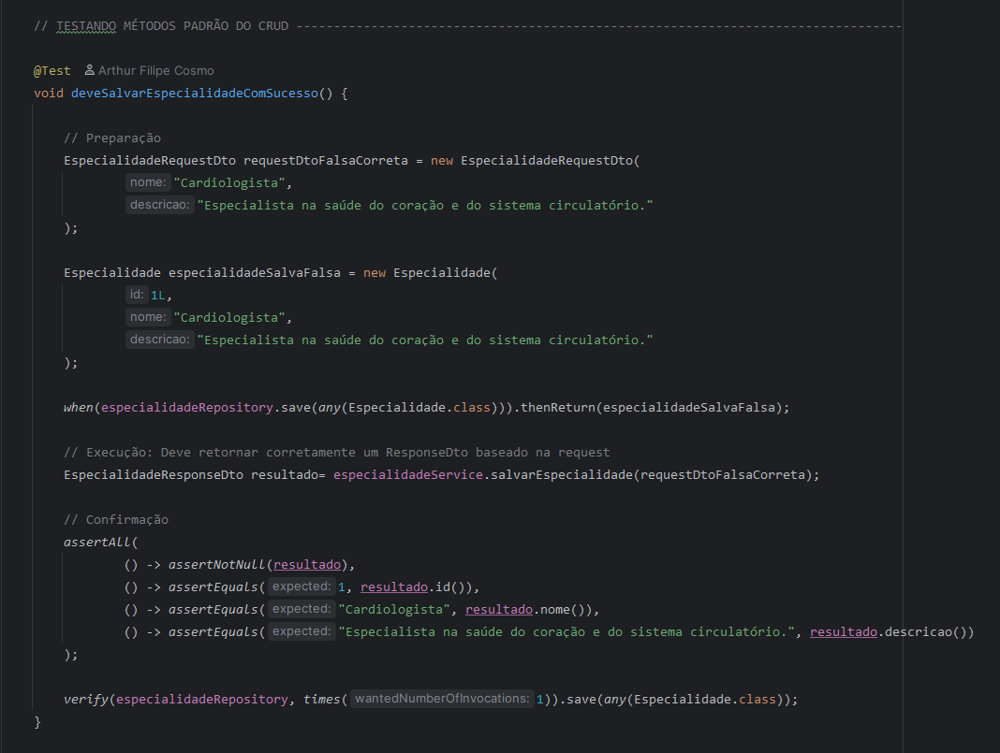
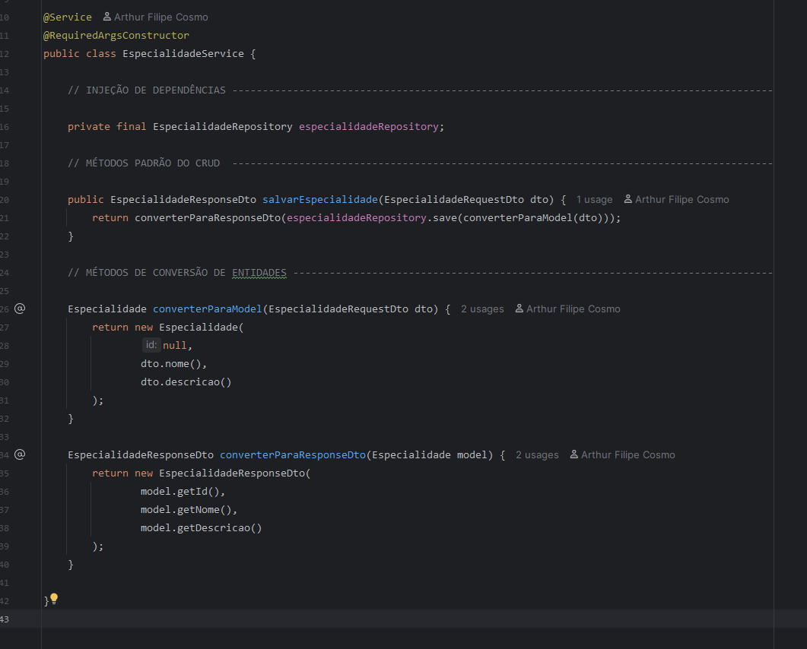

# 🏥 SGCM API — Sistema de Gestão de Clínica Médica

API REST desenvolvida em **Java + Spring Boot** para gerenciamento completo de uma clínica médica: cadastro de pacientes, médicos, especialidades, agendamento de consultas e emissão de prescrições.

> Projeto pessoal desenvolvido do zero, com foco em boas práticas de arquitetura backend, versionamento controlado de banco de dados e cobertura de testes automatizados.

---

## 🚀 Tecnologias

| Categoria | Tecnologia |
|---|---|
| Linguagem | Java 21 (LTS) |
| Framework | Spring Boot 4.1.1 |
| Persistência | Spring Data JPA + Hibernate |
| Banco de dados | MySQL |
| Versionamento de schema | Flyway Migrations |
| Validação | Bean Validation (Jakarta Validation) |
| Redução de boilerplate | Lombok |
| Testes | JUnit 5 + Mockito |
| Build | Maven |
| Documentação de API | Swagger / OpenAPI *(em desenvolvimento)* |
| Segurança | Spring Security + JWT *(em desenvolvimento)* |

---

## 🏗️ Arquitetura e decisões técnicas

Este projeto foi construído com atenção deliberada a decisões arquiteturais, não apenas fazendo "funcionar":

- **Flyway-first**: todas as migrações de banco são escritas em SQL puro *antes* das entidades Java — o schema do banco é a fonte da verdade, e o Hibernate roda em modo `ddl-auto=validate` (nunca `update`), garantindo que a aplicação nunca aplique mudanças de schema "silenciosamente".
- **Separação em camadas** bem definida: `Model` → `Repository` → `Service` → `Controller`, com DTOs de Request/Response dedicados para cada entidade, evitando exposição direta das entidades JPA na API.
- **Credenciais fora do versionamento**: uso de profiles (`application-local.properties`) e variáveis de ambiente para dados sensíveis, nunca commitados.
- **Testes unitários com Mockito**: camada de Service coberta por testes isolados (mocking de repositórios), validando tanto o retorno dos métodos quanto as interações esperadas com a camada de persistência.

---

## 📦 Domínio da aplicação

- **Especialidade** — especialidades médicas disponíveis na clínica
- **Médico** — profissionais cadastrados, vinculados a uma especialidade
- **Paciente** — cadastro de pacientes da clínica
- **Consulta** — agendamento entre médico e paciente, com status (`AGENDADA`, `CONFIRMADA`, `REALIZADA`, `CANCELADA`)
- **Prescrição** — vinculada a uma consulta realizada

Cada entidade possui camada completa de CRUD (criar, listar, buscar por ID, atualizar, deletar), DTOs de entrada e saída próprios, e validação de dados na borda da aplicação.

---

## 🗺️ Status do projeto

- [x] Modelagem do banco (Flyway migrations)
- [x] Camada de entidades (Model)
- [x] Camada de repositório
- [x] DTOs de Request/Response com validação
- [ ] Camada de Service (CRUD + testes unitários) — *em desenvolvimento*
- [ ] Camada de Controller
- [ ] Tratamento centralizado de exceções
- [ ] Documentação Swagger
- [ ] Autenticação e autorização com Spring Security + JWT

---

## 📸 Demonstrações da codificação

### 📂 Estrutura de diretórios

### ⚪ Migrations

### ⚪ DTO's + Validação

### ⚪ Testes unitários

### ⚪ Services

---

## 👤 Sobre o desenvolvedor

Desenvolvido por **Arthur Cosmo**, desenvolvedor em formação com base sólida em **Java e Orientação a Objetos** (encapsulamento, herança, polimorfismo, interfaces), atualmente aprofundando conhecimento em **Spring Boot, testes automatizados e arquitetura de APIs REST**.

Este projeto reflete um processo de aprendizado ativo e documentado: cada decisão técnica — do versionamento de schema com Flyway à separação em DTOs — foi tomada de forma consciente, utilizando conhecimentos adquiridos em meus estudos sobre desenvolvimento de software, não é um projeto copiado de tutoriais.

📍 Recife, PE — em busca de oportunidade como desenvolvedor júnior.

